# Tree Diffusion Schr&ouml;dinger Bridge

This is the official code for the paper 'Tree-Based Diffusion Schr&ouml;dinger Bridge with Applications to Wasserstein
Barycenters'. It extends the framework of [Diffusion Schr&ouml;dinger Bridge](https://arxiv.org/abs/2106.01357) to any
tree-structured joint distribution with known marginals on the leaves (thus including the classical Schr&ouml;dinger
Bridge problem). By considering star-shaped trees, it enables to compute regularized Wasserstein-2 barycenters for
high-dimensional empirical probability
distributions, which is of main interest in Optimal Transport (OT).

Illustration
------------

Estimation of 2D densities (first row: OT reg=0.05) and approximation of their Wasserstein-2 barycenter obtained by
diffusing from each leaf (second row: OT reg=0.05 with 35 IPF cycles, third row: OT reg=0.1 with 20 IPF cycles, fourth
row: OT reg=0.2 with 20 IPF cycles). These plots are obtained without applying the Langevin corrector. Barycenter
pictures are available with corrector 0.02 (see `./images`).

| Swiss Roll                                                                                                    | Circle                                                                                                          | Moons                                                                                                         |
|---------------------------------------------------------------------------------------------------------------|-----------------------------------------------------------------------------------------------------------------|---------------------------------------------------------------------------------------------------------------|
| 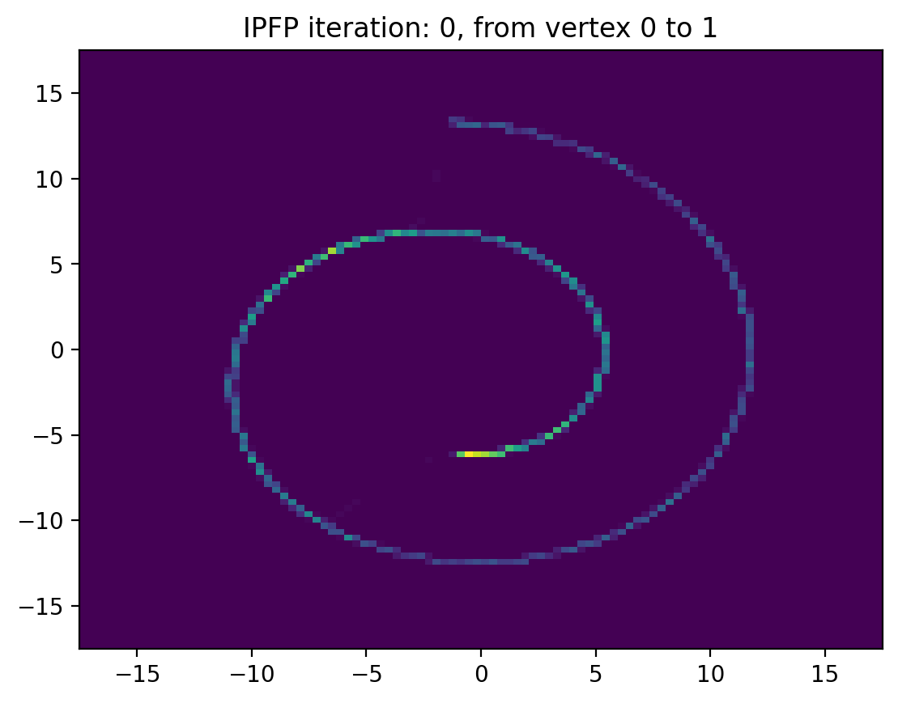                | 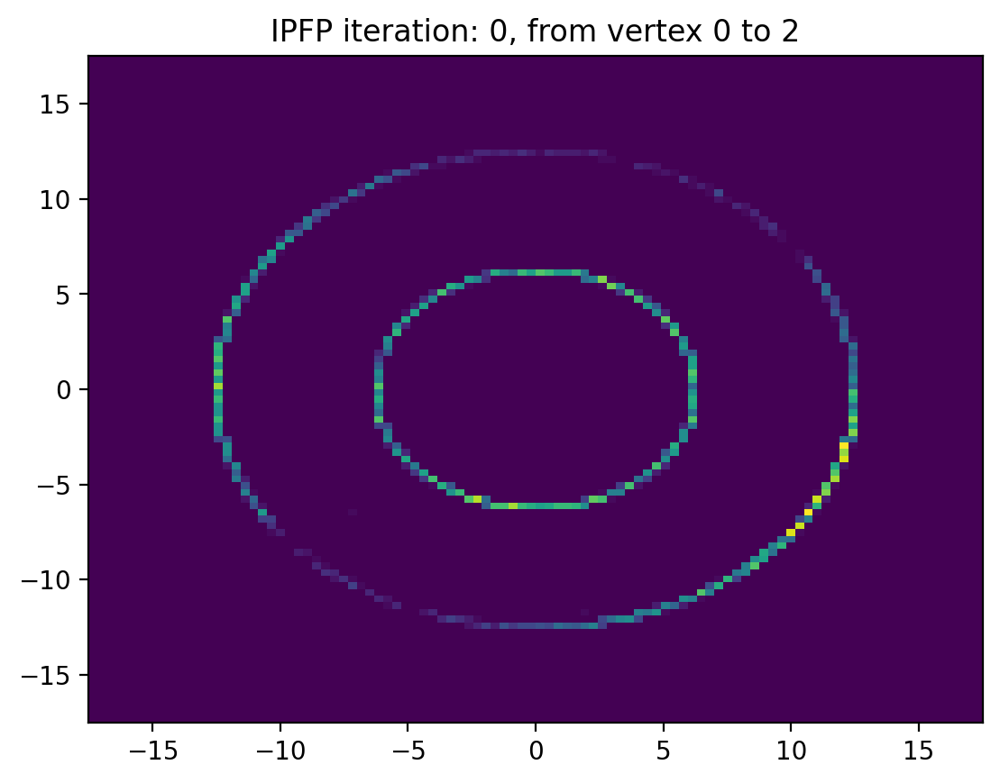                | 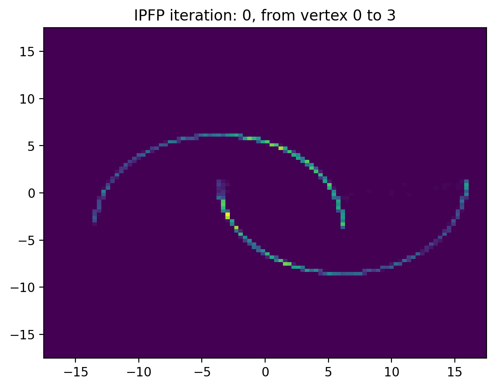                |
| 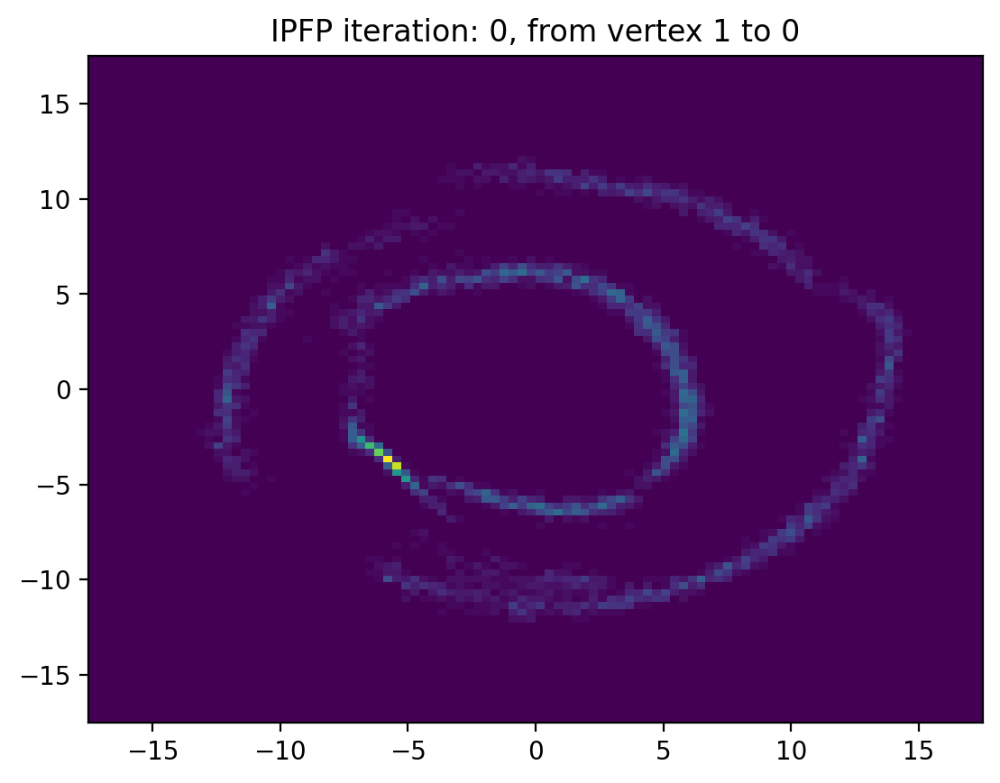 | 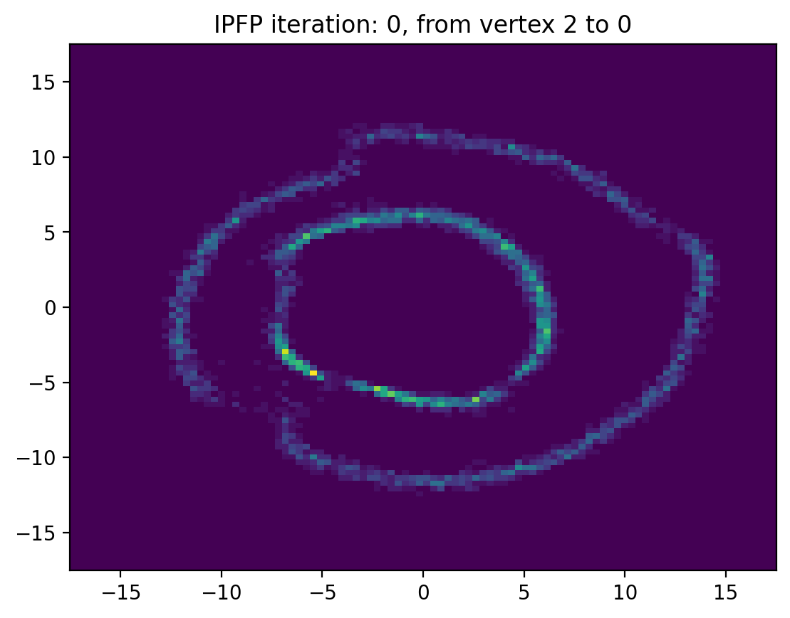 | 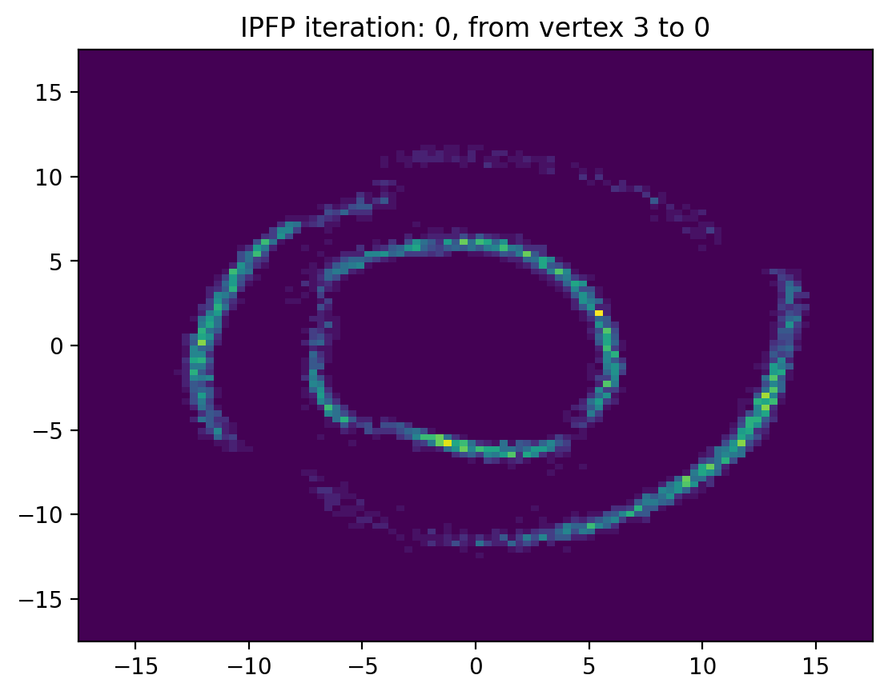 |
| 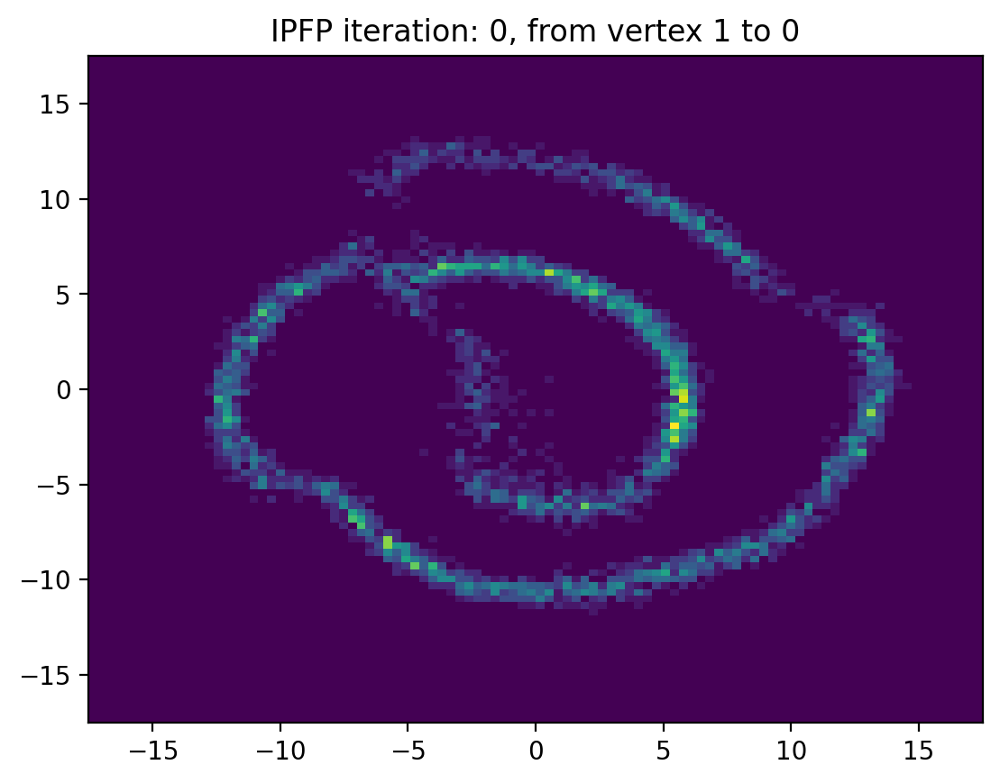  | 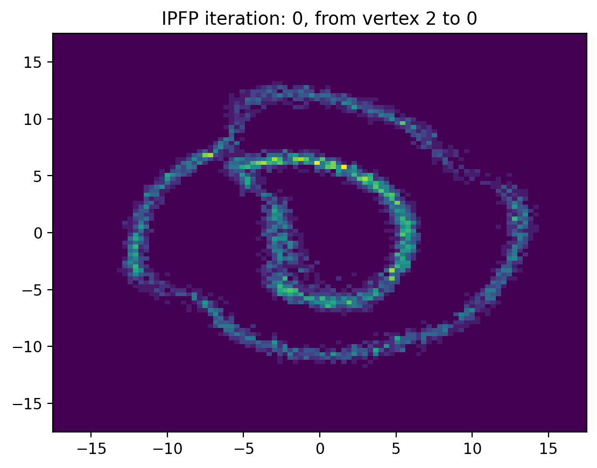  | 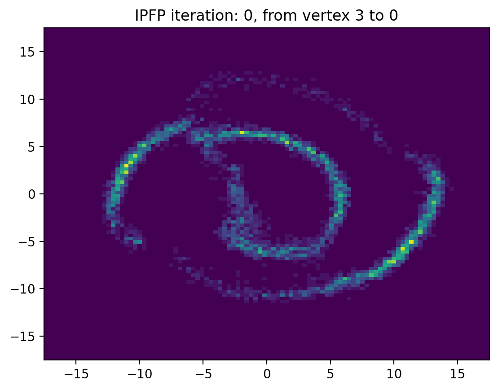  |
| 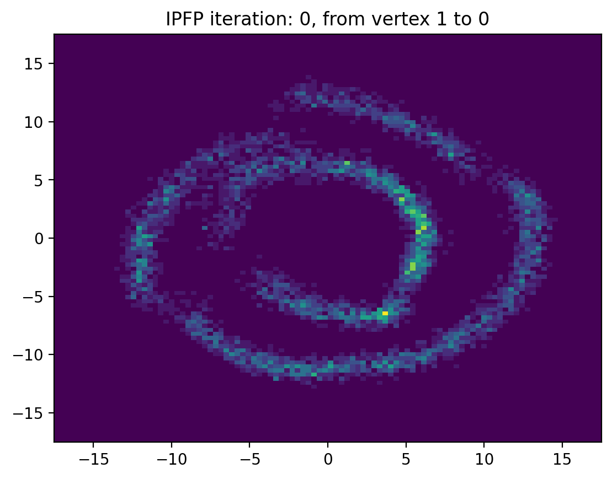  | 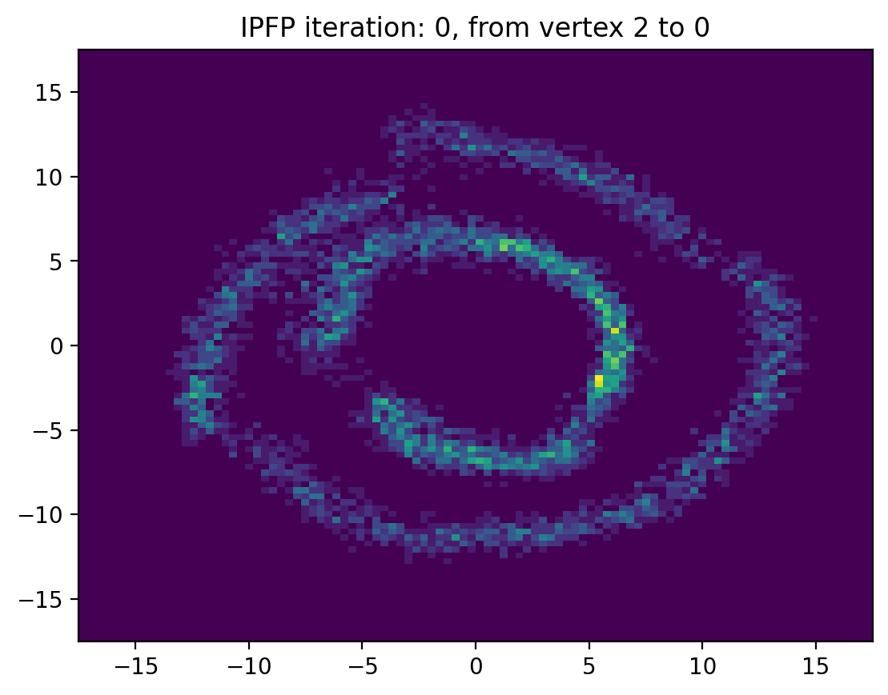  | 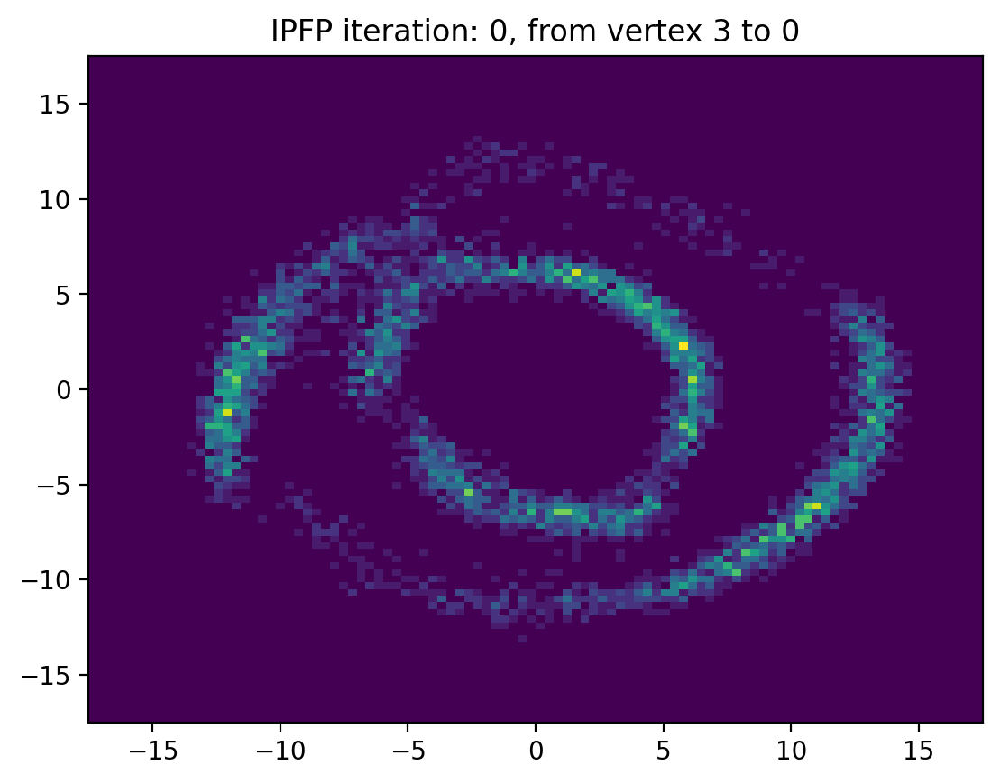  |

Contributors
------------

* Maxence Noble
* Valentin De Bortoli

Installation
------------

This project can be installed from its git repository.

1. Obtain the sources by:

   `git clone git@github.com:maxencenoble/tree-diffusion-schrodinger-bridge.git`

You may modify `requirements.txt` according to your CUDA version.

2. Install the packages via an Anaconda environment:

- `conda create -n tree_dsb python=3.8`
- `conda activate tree_dsb`
- `pip install -r requirements.txt`

How to use this code?
---------------------

For CELEBA, make sure that you already have in the path `./data/celeba` the 6 required files:

- `list_landmarks_align_celeba.txt`
- `list_eval_partition.txt`,
- `list_bbox_celeba.txt`,
- `list_attr_celeba.txt`,
- `img_align_celeba.zip`,
- `identity_CelebA.txt`.

You can find them
at https://drive.google.com/drive/folders/0B7EVK8r0v71pWEZsZE9oNnFzTm8?resourcekey=0-5BR16BdXnb8hVj6CNHKzLg.

1. Download datasets:

- MNIST: `python data.py --data mnist`
- CELEBA: `python data.py --data celeba`
- Posterior aggregation (already available): `python data_posterior.py --data wine --splitting hom/het`

2. Change the configuration files:

- `./config/config.yaml`: SDE and/or ODE to save plots, starting leaf seed, corrector setting
- `./config/dataset/`: specific settings for each dataset (OT regularization, training setting...)
- `./config/model/`: specific setting for each model (fully connected neural network: Basic or UNET)

The size of the cache dataset used to obtain samples in the training stage is given by : `cache_npar`
x `num_cache_batches` x `num_steps` x `SHAPE`,
where `SHAPE` is the shape of the samples. Make sure that the parameter `num_workers` fits on your machine.
If GPU has insufficient memory, then reduce the cache size.

3. Train models and save plots:

- 2d, 2 datasets - Bridge (CPU):  `python train_model.py dataset=2d_bridge model=Basic tree=Bridge`
- 2d, 3 datasets - Barycenter (CPU):  `python train_model.py dataset=2d_3datasets model=Basic tree=Barycenter`
- Gaussian, 3 datasets - Barycenter (CPU, no
  plot):  `python train_model.py dataset=gaussian_3datasets model=Basic tree=Barycenter`
- Posterior, 3 datasets - Barycenter (CPU, no
  plot):  `python train_model.py dataset=posterior_3datasets model=Basic tree=Barycenter`
- MNIST, 2 datasets - Barycenter (GPU):`python train_model.py dataset=stackedmnist_2datasets model=UNET tree=Barycenter`
- MNIST, 3 datasets - Barycenter (GPU):`python train_model.py dataset=stackedmnist_3datasets model=UNET tree=Barycenter`
- CELEBA, 2 datasets - Barycenter (GPU):`python train_model.py dataset=celeba_2datasets model=UNET tree=Barycenter`

Checkpoints and sampled images will be saved to a newly created directory named `experiments`.

4. Use checkpoint models:

- Make sure that the pretrained models are saved according to the structure of the tree you are considering (ie, the
  directory of checkpoints for this experiment has local directories `source=...,dest=.../`, each one containing
  networks for the forward and the backward sampling directions that match `datasets`).
- Set `checkpoint_run` to True in the dataset configuration file.

In this repository, there are 3 sets of pretrained models for the setting `2d_3datasets` with equal barycenter weights,
each one corresponding to a certain level of OT regularization (`epsilon=0.2, 0.1, 0.05`). To use them, make sure that
you modify the following
parameters in the dataset configuration file:

- `epsilon`
- `checkpoints_dir`
- `checkpoints_dir`, `checkpoint_b`

5. Train models from pretrained models:

- Follow Step 4.
- Set `start_n_ipf` to the IPF iteration corresponding to the pretrained models.

Checkpoints and sampled images will be saved to a newly created directory named `experiments`.

6. Test pretrained models:

- Follow Step 4.
- 2d, 2 datasets - Bridge (CPU):  `python test_model.py dataset=2d_bridge model=Basic tree=Bridge`
- 2d, 3 datasets - Barycenter (CPU):  `python test_model.py dataset=2d_3datasets model=Basic tree=Barycenter`
- Gaussian, 3 datasets - Barycenter (CPU, no
  plot):  `python test_model.py dataset=gaussian_3datasets model=Basic tree=Barycenter`
- Posterior, 3 datasets - Barycenter (CPU, no
  plot):  `python test_model.py dataset=posterior_3datasets model=Basic tree=Barycenter`
- MNIST, 2 datasets - Barycenter (GPU):`python test_model.py dataset=stackedmnist_2datasets model=UNET tree=Barycenter`
- MNIST, 3 datasets - Barycenter (GPU):`python test_model.py dataset=stackedmnist_3datasets model=UNET tree=Barycenter`
- CELEBA, 2 datasets - Barycenter (GPU):`python test_model.py dataset=celeba_2datasets model=UNET tree=Barycenter`

Checkpoints and sampled images will be saved to a newly created directory named `experiments`.

7. Check the setting in `run_free_support_barycenter.py` and compare with the method from Cuturi and Doucet (2014):

- 2d, 3 datasets - Barycenter (CPU):  `python run_free_support_barycenter.py --data 2d`
- Gaussian, 3 datasets - Barycenter (CPU):  `python run_free_support_barycenter.py --data gaussian`
- Posterior, 3 datasets - Barycenter (CPU):  `python run_free_support_barycenter.py --data posterior`

